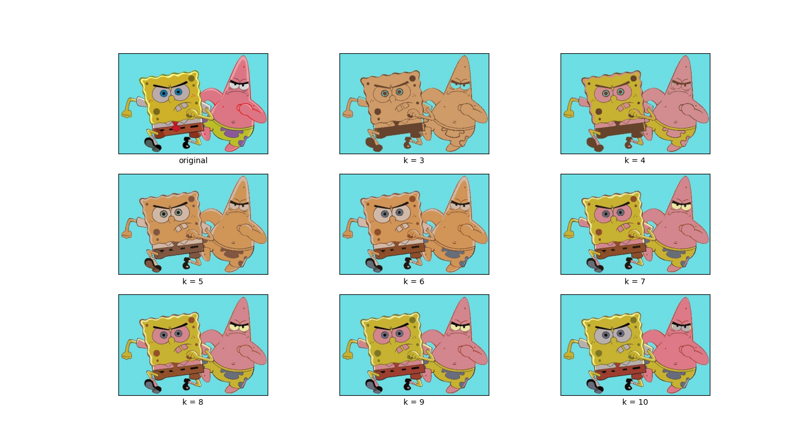
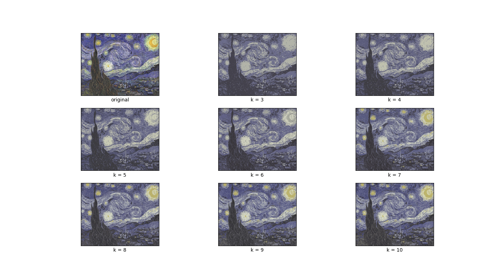
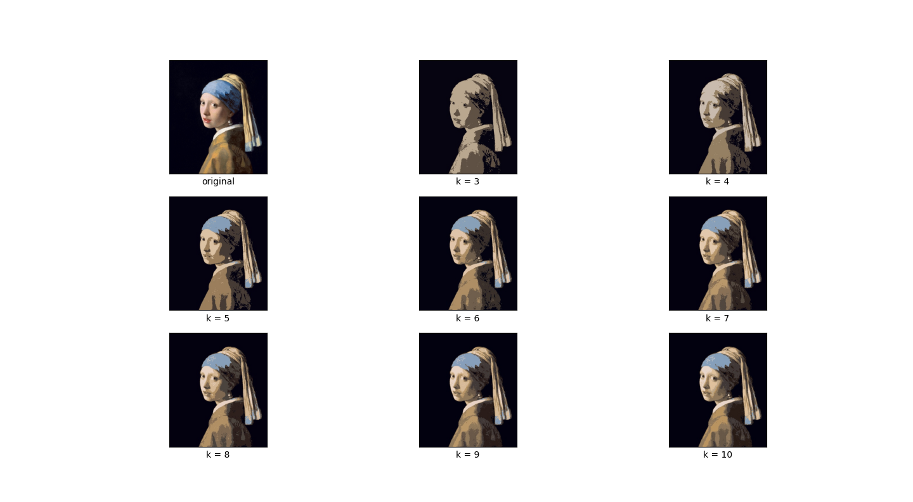

# K-Compress
Simplifying Images through Color Clustering

# To run the python code
you should install python libraries uising 

pip install -r requirements.txt 

img1.jpg img2.jpg img3.jpg are original images

result images of k mean are in FinalImage folder

If you want to see a comparative image that changes as the value of k changes, take a look at the CompareImage folder.

result.txt is the console log of the program. take a look if you want to see centroid values

# Results

## Progression of k clustering

